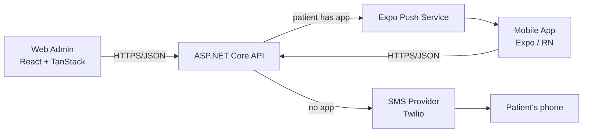

# Architecture

## System overview



**Core flow — "ready to be seen":**

1. Nurse/provider opens the admin app, selects a patient, clicks **Ready to be seen**.
2. Admin calls `POST /api/notifications/ready` with the patient id.
3. API decides the channel: patient has a registered app install → push notification; otherwise → SMS.
4. Notification content is generic ("You're ready to be seen") — **never PHI**. See [compliance.md](compliance.md).
5. Delivery status is tracked on the `ReadyNotification` record (`pending → sent → delivered/failed`) so staff can see whether the ping landed.

## Monorepo

pnpm workspaces + Turborepo. Two shared packages sit between the frontends and the API contract:

- **`@sona/shared`** — domain types (`Patient`, `Provider`, `ReadyNotification`) and zod schemas for every API input. Single source of truth for the contract on the TS side.
- **`@sona/api-client`** — fetch wrapper (`apiFetch`) plus typed endpoint functions (`patientsApi`, `notificationsApi`). Each app configures it at startup (`configureApiClient`) with its own base URL and token getter.

Both packages are consumed as raw TypeScript source — no build step, no version skew.

## Frontend structure (bulletproof-react)

Both frontends follow the [bulletproof-react](https://github.com/alan2207/bulletproof-react) pattern: **unidirectional dependencies** (`app → features → shared modules`), feature code co-located under `features/<name>/`, and cross-feature imports discouraged.

```
src/
├── app/            # application shell: routes, providers, router
│   ├── routes/     # file-based routes (TanStack Router on web, Expo Router on mobile: src/app/)
│   └── provider.tsx
├── components/     # shared, feature-agnostic UI components
├── config/         # env access (env.ts) — the only place process.env / import.meta.env is read
├── features/       # feature modules
│   └── notifications/
│       ├── api/         # TanStack Query options + mutation hooks for this feature
│       └── components/  # feature-specific components
├── hooks/          # shared hooks
├── lib/            # preconfigured library instances (query-client, api-client)
├── stores/         # global client state (add Zustand here when needed)
├── types/          # shared TS types local to this app
└── utils/          # shared pure utilities
```

Conventions:

- **Server state** lives in TanStack Query. Query definitions use the `queryOptions()` helper in `features/*/api/get-*.ts`; mutations are `use*` hooks in `features/*/api/`.
- **Client state** (UI state, session) goes in `stores/` — add Zustand when the first real need appears; don't put server data there.
- **Forms** use TanStack Form + the zod schemas from `@sona/shared` so web, mobile, and API validate identically.
- **Imports** use the `@/` alias; features must not import from other features.

On mobile, Expo Router owns `src/app/` (its file-based routing convention); everything else matches the web layout.

## Backend

ASP.NET Core (.NET 10) minimal API with an EF Core data layer on **SQL Server** (entities under `Features/*`, `SonaDbContext` + configurations under `Data/`, schema versioned via EF migrations — see [data-model.md](data-model.md) for the table designs and [getting-started.md](getting-started.md) for the local DB workflow). Planned shape:

- Vertical-slice organization per feature (`Patients`, `Messaging`, `Imports`, `Users`) mirroring the frontend `features/` layout.
- `POST /api/notifications/ready` encapsulates channel selection (push vs SMS) behind one endpoint — clients never choose the channel.
- OpenAPI document published in development; long-term, TS types in `@sona/shared` should be generated from it.

## Notification channel decision

Channel selection is **server-side only**. The admin UI shows which channel will be used (`patient.hasApp`), but the API makes the call at send time. This keeps the rule in one place and lets a patient's app registration change without touching clients.
