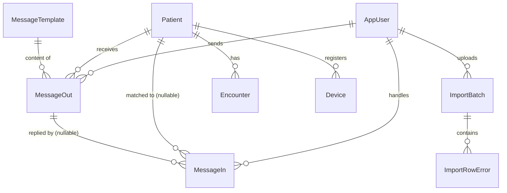

# Data Model

Database tables for Sona. Status: **MVP tables implemented** (SQL Server via EF Core, migrations in `apps/api/Sona.Api/Migrations/`); Enhancement tables remain design-only. Physical table names are pluralized (`Patients`, `AppUsers`, `MessagesOut`, ...).

Phasing follows the product roadmap:

| Phase | Scope |
|---|---|
| **MVP** | One-way SMS to patient from web admin; patient import (flat file or UI entry) |
| **Enhancement 1** | Patient SMS reply-back; Cerner integration |
| **Enhancement 2** | Patient mobile app (push notifications) |

Conventions (all tables):

- Primary keys are UUIDs (`Id`), matching the string ids in `@sona/shared`.
- Every table has `CreateDate` and `ModDate` (UTC).
- Soft delete via `IsActive` where noted — patient and message rows are never hard-deleted (audit trail).
- Phone numbers stored in E.164 format (`+15551234567`), matching `e164Phone` in `packages/shared/src/schemas.ts`.
- **No PHI ever leaves the database in a notification payload, log line, or URL** — see [compliance.md](compliance.md).

> **Contract note:** `packages/shared` is the source of truth for domain types. `MessageOut` below corresponds to the existing `ReadyNotification` type; `Patient` corresponds to `Patient`. When these tables are implemented, align names/statuses in `packages/shared` in the same task so the DB and TS contract don't drift.

---

## Patient — MVP

Patient demographics, ingested via flat-file import, manual UI entry, or (later) Cerner.

Renamed from the original proposal (which used `appUser` for patient data) — patient demographics and internal login accounts are different tables. Internal staff live in [AppUser](#appuser-staff--mvp).

| Field | Type | Notes |
|---|---|---|
| `Id` | uuid PK | |
| `Mrn` | string, unique, indexed | Person-level medical record number. Business identifier — unique constraint, but keep `Id` as PK (MRNs can be re-issued/merged in HIS migrations). |
| `FirstName` | string | Split from the original single `PatientName` field — matches the `Patient` type in `@sona/shared`, and import files typically arrive split. |
| `LastName` | string | |
| `Dob` | date | PHI — fine at rest (encrypted DB), never in messages. |
| `MobileNumber` | string (E.164) | Contact info, not identity — patients change numbers. Messages snapshot the number at send time (see `MessageOut`). |
| `SmsConsent` | bool | **TCPA requirement** — patient must consent to receive texts. Do not send SMS when false. |
| `SmsConsentDate` | datetime, nullable | When consent was captured. |
| `IsUsingMobileApp` | bool | MVP: manually set flag. Enhancement 2: becomes derived from `Device` registrations — stop setting it by hand. |
| `InCerner` | bool | Whether the patient exists in Cerner (Enhancement 1 sync flag). |
| `ImportSource` | string enum: `flatfile` \| `ui` \| `cerner` | Which ingest path wrote/last-updated this row — with 2+ ingest paths this answers "where did this data come from" during support. |
| `IsActive` | bool, default true | Soft delete. |
| `CreateDate` | datetime | |
| `ModDate` | datetime | |

**Dropped from original proposal:** `FIN`. FIN is an encounter (visit) identifier in Cerner and changes every visit — a single column on the patient row goes stale immediately. It moves to the [Encounter](#encounter--enhancement-1-cerner) table.

---

## AppUser (Staff) — MVP

Internal users of the admin platform (nurses, providers, admins). **Missing from the original proposal** — required for MVP: the admin platform needs authenticated accounts, and the audit requirement ("who sent it") needs a staff id to reference.

Corresponds to the `Provider` type in `@sona/shared`.

| Field | Type | Notes |
|---|---|---|
| `Id` | uuid PK | |
| `FirstName` | string | |
| `LastName` | string | |
| `Email` | string, unique | Login identifier. |
| `Role` | string enum: `nurse` \| `provider` \| `admin` | Matches `UserRole` in `@sona/shared`. Role checks are server-side, never client-only ([compliance.md](compliance.md)). |
| `IsActive` | bool, default true | Deactivate instead of delete — sent messages keep a valid sender reference. |
| `CreateDate` | datetime | |
| `ModDate` | datetime | |

Credential storage depends on the auth approach (hosted identity provider vs local) — decide before implementation; no password column until then.

---

## MessageOut — MVP

Outbound "ready to be seen" message to a patient. This **is** the audit log for sends — every send code path must write a row here first; no fire-and-forget ([compliance.md](compliance.md) requires who / to whom / when / channel / outcome).

Corresponds to `ReadyNotification` in `@sona/shared`.

| Field | Type | Notes |
|---|---|---|
| `Id` | uuid PK | |
| `PatientId` | uuid FK → Patient | Original proposal had `34ID` (assumed FK typo) — a proper FK to the patient. |
| `SentByUserId` | uuid FK → AppUser | **Added — compliance requirement.** Who triggered the send. |
| `Channel` | string enum: `sms` \| `push` | MVP is always `sms`; column exists now so Enhancement 2 doesn't need a migration + the TS contract already has it. |
| `MessageTemplateId` | uuid FK → MessageTemplate, nullable | Which approved template was sent. Prefer this over free text — see PHI note below. |
| `Body` | string, nullable | Rendered text as actually sent. Snapshot for audit; must come from an approved template, never operator free-text. |
| `MobileNumber` | string (E.164), nullable | Snapshot of the number at send time (patient may change numbers later — the audit record keeps what was actually dialed). Null for push. |
| `Status` | string enum: `pending` \| `sent` \| `delivered` \| `failed` | **Added.** Matches `NotificationStatus` in `@sona/shared`. `SentDateTime` alone cannot represent pending/failed. |
| `ProviderMessageSid` | string, nullable, indexed | **Added.** Twilio message SID (or push ticket id). Delivery status arrives later via webhook — this is the correlation key. Without it, no delivery tracking. |
| `FailureReason` | string, nullable | Carrier/provider error on `failed`. |
| `SentDateTime` | datetime, nullable | Null while `pending`. |
| `DeliveredDateTime` | datetime, nullable | Set from delivery webhook. |
| `CreateDate` | datetime | |
| `ModDate` | datetime | |

**Changed from original proposal:**

- `MessageAcknowledged` dropped — ambiguous. Carrier delivery receipt ≠ patient acknowledgment. For one-way MVP only the delivery receipt exists, and that's `Status = delivered`. When reply-back or the app exists, add `AcknowledgedDateTime` (set from an inbound reply or in-app tap) — a timestamp, not a bool.
- Free-text `Message` replaced by template reference + rendered snapshot. A writable free-text column is the easiest way for PHI to leak into an SMS; template gating keeps content reviewed and generic.

---

## MessageTemplate — MVP (small but recommended)

Approved outbound message texts. The PHI review gate: content is reviewed once here, and send paths can only pick from this table.

| Field | Type | Notes |
|---|---|---|
| `Id` | uuid PK | |
| `Key` | string, unique | e.g. `ready-to-be-seen` |
| `Body` | string | Generic content only — "You're ready to be seen. Please come to the front desk." No conditions, reasons, specialty or clinic names implying a condition. |
| `IsActive` | bool | Retire templates without breaking old `MessageOut` references. |
| `CreateDate` | datetime | |
| `ModDate` | datetime | |

MVP can seed a single row. The table earns its keep the first time someone asks for a second message variant.

---

## ImportBatch / ImportRowError — MVP (if flat-file import ships)

Audit trail for flat-file patient imports: which file, who uploaded it, what happened. **Missing from the original proposal.** Without it, a bad import is undiagnosable ("which file created these 400 patients?").

**ImportBatch**

| Field | Type | Notes |
|---|---|---|
| `Id` | uuid PK | |
| `FileName` | string | |
| `UploadedByUserId` | uuid FK → AppUser | |
| `Status` | string enum: `processing` \| `completed` \| `failed` | |
| `RowsTotal` | int | |
| `RowsImported` | int | |
| `RowsFailed` | int | |
| `CreateDate` | datetime | |
| `ModDate` | datetime | |

**ImportRowError**

| Field | Type | Notes |
|---|---|---|
| `Id` | uuid PK | |
| `ImportBatchId` | uuid FK → ImportBatch | |
| `RowNumber` | int | |
| `ErrorMessage` | string | Validation error only (e.g. "invalid phone format") — do not echo the full raw row here; it contains PHI and error tables tend to get read/exported casually. |
| `CreateDate` | datetime | |

`Patient.ImportBatchId` (nullable FK, SetNull on delete) traces each imported patient row to its source file — implemented.

---

## MessageIn — Enhancement 1 (SMS reply-back)

Inbound SMS from patients. Original proposal was the right skeleton; additions below deal with matching and staff workflow.

| Field | Type | Notes |
|---|---|---|
| `Id` | uuid PK | |
| `MobileNumber` | string (E.164) | Number the reply came from. |
| `PatientId` | uuid FK → Patient, **nullable** | Matched by phone lookup. **Nullable on purpose:** family members share phones and numbers get recycled, so a number can match zero or multiple patients. Ambiguous/unmatched rows go to manual triage. |
| `MatchedMessageOutId` | uuid FK → MessageOut, nullable | Which outbound message this appears to reply to (most recent outbound to that number within a window). |
| `Body` | string | Raw inbound text. Treat as PHI — patients will type anything. |
| `ProviderMessageSid` | string, unique, indexed | Twilio inbound SID. Unique constraint = dedupe on webhook retries. |
| `ProcessedStatus` | string enum: `unread` \| `handled` \| `ignored` | Staff triage queue state. |
| `HandledByUserId` | uuid FK → AppUser, nullable | Who processed it. |
| `ReceivedDateTime` | datetime | |
| `CreateDate` | datetime | |
| `ModDate` | datetime | |

---

## Encounter — Enhancement 1 (Cerner)

Visit-level data from Cerner. This is where **FIN** lives — FIN identifies an encounter, not a person, and changes every visit (which is why it was removed from `Patient`).

Shape is a starting point; finalize against the actual Cerner integration contract.

| Field | Type | Notes |
|---|---|---|
| `Id` | uuid PK | |
| `PatientId` | uuid FK → Patient | |
| `Fin` | string, indexed | Cerner encounter identifier. Unique per visit. |
| `AdmitDateTime` | datetime, nullable | |
| `DischargeDateTime` | datetime, nullable | |
| `Status` | string enum: `active` \| `discharged` (extend per Cerner states) | |
| `CreateDate` | datetime | |
| `ModDate` | datetime | |

Consider later: `MessageOut.EncounterId` (nullable FK) so a "ready" ping is tied to the visit it belongs to.

---

## Device — Enhancement 2 (mobile app)

Registered patient devices for push notifications. Replaces manual maintenance of `Patient.IsUsingMobileApp` — a patient can have multiple devices, and push tokens rotate.

| Field | Type | Notes |
|---|---|---|
| `Id` | uuid PK | |
| `PatientId` | uuid FK → Patient | |
| `PushToken` | string, unique | Expo push token. Rotates — update on app launch. |
| `Platform` | string enum: `ios` \| `android` | |
| `LastSeenDateTime` | datetime | Prune stale registrations. |
| `IsActive` | bool | Set false on push-service "token invalid" responses. |
| `CreateDate` | datetime | |
| `ModDate` | datetime | |

Once this table exists, `Patient.IsUsingMobileApp` = "has ≥1 active device" (derived or maintained by trigger/app logic) — server-side channel selection reads this at send time ([architecture.md](architecture.md)).

---

## Relationships overview

## Open questions

- **Auth approach for `AppUser`** — hosted identity provider vs local credentials. Blocks the `AppUser` table's final shape.
- **Retention policy** — how long to keep `MessageOut`/`MessageIn` rows; HIPAA-adjacent records typically 6+ years, confirm in compliance review.
- **Cerner integration shape** — `Encounter` fields are placeholders until the integration contract (HL7? FHIR? file drop?) is known.
