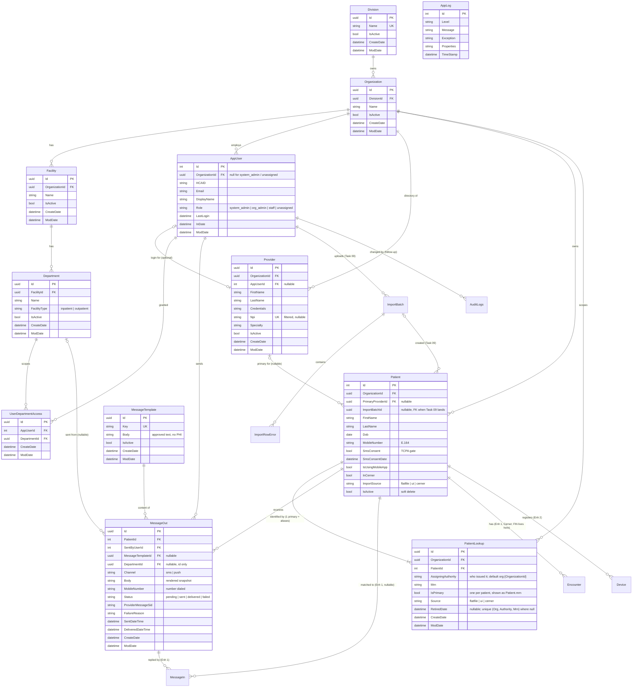

# Task 19 — Org hierarchy v2 (Division / Facility / FacilityType) + PatientLookup

**Status:** spec'd 2026-09-02 after team review; open questions resolved 2026-09-02 (§7). Ready to start.
**Prerequisite:** none — migration baseline fixed 2026-08-27; add migrations with `--output-dir Data/Migrations`. Run `dotnet ef` under the `Local` profile (`ASPNETCORE_ENVIRONMENT=Local`) so no Azure credentials are needed.
Read `docs/tasks/_context.md`, `AGENTS.md`, `docs/data-model.md` (§ Organization hierarchy, § Multi-practice patients) and `docs/admin-ui-guide.md` (org structure + organizations pages) first.

## 1. Goal

Align the tenant hierarchy with the real-world structure — **Division → Organization → Facility → Department** — and add a care-setting label to departments.

Real-world example that drove the design: **North Carolina Division** (division) owns **Asheville Cardiology & Associates** (organization), which has facilities in **Asheville** and **Hendersonville**, some of which have both an **inpatient** and an **outpatient** department.

Second goal: introduce **`PatientLookup`** as the single home of patient identifiers, so a patient can carry MRNs from more than one source (practice EMR today; Cerner/Mission feeds, EMR migrations, chart merges later). Decided 2026-09-02: the multi-source case is expected, so the structure goes in now while every patient still has exactly one MRN and the migration is trivial.

Two parts, two migrations, two PRs. Part A is pure hierarchy; Part B moves MRN storage. Do not combine — the review surface is too large.

## 2. Decisions settled (do not re-litigate)

| Decision | Rationale |
|---|---|
| **Tenant boundary stays at `Organization`.** `DivisionId` goes on `Organization` only — never on `Patient`, `Provider`, `MessageOut`, `AppUser`. | Division is an ownership/reporting grouping. Cross-org patient visibility stays forbidden (tenant isolation, per-practice TCPA consent — `data-model.md` § Multi-practice patients). |
| **MRN is unique per organization** for the first tenant (confirmed 2026-09-02; a practice EMR has one MRN pool across its locations). Uniqueness is enforced on `PatientLookup (OrganizationId, AssigningAuthority, Mrn)`, where the assigning authority defaults to the org itself. | Assigning authority (HL7 PID-3 / FHIR `identifier.system`) absorbs a per-facility or external MRN pool later without a schema change. |
| **`Patient.Mrn` column is removed; `PatientLookup` is the only store of identifiers.** The API contract's `Patient.mrn` stays and is projected from the primary lookup row. | One source of truth — no dual writes, nothing to drift. Zero contract/client change. Cheapest to do now, while each patient has exactly one MRN. |
| **`Patient.OrganizationId` stays on `Patient`.** | Tenant column belongs on every tenant-owned row; needing a join to know the owner is how tenant leaks happen. |
| **Cross-org "same person" stays unlinked.** | A future `Person` layer (mobile app) — separate design, separate compliance review. |
| **`Department.FacilityType` is a label**, values `inpatient \| outpatient`. No send-path behaviour attached. | Confirmed 2026-09-02: needed for future filtering, not for gating. Column name kept for parity with existing HCA schemas even though it lives on `Department`. |
| **No `Coid`, no `Division.Code`.** | No current use (2026-09-02). Add when a consumer exists. |
| **No `Patient.CreateDate`/`ModDate`.** Change history for all tables will come from a future `AuditLogs` table (pattern from the team's other apps: what changed, when, by whom). | Decided 2026-09-02; separate task, not spec'd yet. |
| **Roles unchanged.** No `division_admin`. | No user needs it yet. |
| **Division gets a real admin page** (system_admin), not just an API. | Decided 2026-09-02 (Q8). |
| **Patient keeps its `int` PK.** | PK change ripples through `MessageOut` FKs and the contract for no functional gain. |

## 3. Part A — hierarchy (one migration: `OrgHierarchyV2`)

### 3.1 `Division` (new, `EntityBase`)

| Field | Type | Notes |
|---|---|---|
| `Id` | uuid PK | |
| `Name` | string(200), required | e.g. "North Carolina Division". Unique (case-insensitive collation is the SQL Server default). |
| `IsActive` | bool, default true | |
| `CreateDate` / `ModDate` | datetime | via `EntityBase` |

- `Organization.DivisionId` — **required** uuid FK → `Division`, `Restrict` delete (a division with organizations cannot be removed).
- **Backfill:** the migration inserts a division with fixed id `22222222-2222-2222-2222-222222222222`, `Name = "Default Division"`, assigns every existing organization (including the seeded `11111111-…` org) to it, then makes the column `NOT NULL`. Same pattern as the Task 08 default-org backfill.

### 3.2 Remove `Organization.Type`

- Drop the column, the `practice | hospital` validation in `OrganizationsController` (create), the DTO field, `organizationTypeSchema` / `OrganizationType` in `packages/shared`, the type select in `features/org-structure/components/organization-form.tsx`, and the assertions in `e2e/org-structure.spec.ts`.
- The auto-created "Main" facility + "General" department on org create **stays**; it never branched on type (verified 2026-09-02 — nothing reads `Type` beyond validation and echo). No consumers outside this repo (Q9).

### 3.3 Rename `Site` → `Facility`

- Table `Sites` → `Facilities`; `Department.SiteId` → `FacilityId`; FK/index names follow. **The migration must use `RenameTable` / `RenameColumn` / `RenameIndex`** — inspect the scaffolded migration and replace any drop+create pair (EF scaffolds drop+create when the entity class is renamed). Data must survive.
- No new columns on `Facility`.

### 3.4 `Department.FacilityType`

- string(20), **required**, values `inpatient | outpatient`. DB check constraint `CK_Departments_FacilityType`. Migration backfills existing rows to `outpatient`; the auto-created "General" department is `outpatient`.
- XML doc comment on the property must say the name is kept for parity with existing HCA schemas, or the next reader will "fix" it.
- **No change in `NotificationsController`.**

### 3.5 API (Part A)

- **`DivisionsController`** — `GET /api/divisions` (any authenticated user; the org create form needs it), `GET /api/divisions/{id}`, `POST /api/divisions`, `PUT /api/divisions/{id}` (`SystemAdmin` policy). Validation: trimmed non-empty `Name`, 409 on duplicate name. `IsActive` toggled via `PUT` (no DELETE — restrict FK anyway). DTO: `{ id, name, isActive, organizationCount }`.
- **`OrganizationsController`** — `POST` requires `divisionId` (400 if missing/unknown/inactive). Organization DTO gains `divisionId` + `divisionName`. `GET /api/organizations` accepts `?divisionId=` filter (system_admin).
- **Facilities** — endpoints `/api/organizations/{id}/sites…` → `/facilities…`, request/response field `siteId` → `facilityId`.
- **Departments** — create requires `facilityType`; update accepts it. DTO gains `facilityType`.
- Style: follow `OrganizationsController` (Task 08) for shape, error bodies, org-scoping.

### 3.6 Contract + client (Part A)

- `packages/shared`: `Division` type; `Organization` gains `divisionId`/`divisionName`, loses `type`; `Site` → `Facility`, `siteId` → `facilityId`; `Department.facilityType`; `FacilityType = "inpatient" | "outpatient"` + `facilityTypeSchema`; `createOrganizationSchema` gains `divisionId: z.guid()`, loses `type`; `createDepartmentSchema`/`updateDepartmentSchema` gain `facilityType` (required on create, optional on update); `createDivisionSchema`/`updateDivisionSchema`. Schema tests for every new/changed schema (Vitest, `schemas.test.ts`).
- `packages/api-client`: `divisionsApi` (list/get/create/update), renamed facility functions, updated organization/department signatures.
- `apps/sona.client`:
  - New feature `features/divisions` (api: `get-divisions.ts`, `create-division.ts`, `update-division.ts`; components: list table via shared `Table`, create/edit form via TanStack Form + shared schemas) and route `src/routes/divisions/index.tsx` — **system_admin only**, nav entry hidden otherwise, forbidden state for other roles (mirror the Providers gate from Task 18). Columns: name, active, organization count; row action: edit. Toasts on save/failure like the other forms.
  - `/organizations` (system_admin): division select on the create form (required), division column in the table, optional division filter.
  - `features/org-structure`: every "Site" label/file/testid → "Facility" (`get-sites.ts` → `get-facilities.ts`, forms, table headers); department form gets a `facilityType` select; departments table gets a `facilityType` column.
  - `features/user-management` (`get-org-structure.ts`, `user-access-form.tsx`): `facilityId` rename, "Facility" grouping label.
  - Fixtures (`src/testing/fixtures.ts`, seed ids incl. `22222222-…`), MSW handlers, component tests updated. `user-access-form.test.tsx` covers the rename.
- Playwright: `e2e/org-structure.spec.ts` (facility wording, department create/edit with type, `@smoke` on the create path), new `e2e/divisions.spec.ts` (system_admin CRUD, staff/org_admin forbidden), `e2e/user-management.spec.ts` if it asserts site labels. Data via the real API with `E2E-` prefixes as usual.
- Every `site-*` `data-testid` becomes `facility-*`; new `division-*` and `department-facility-type*` ids per the guide's derivation rules. **`docs/admin-ui-guide.md` updated in the same commit** (AGENTS.md §4).

## 4. Part B — `PatientLookup` (one migration: `PatientLookup`)

### 4.1 Table (new, `EntityBase`)

| Field | Type | Notes |
|---|---|---|
| `Id` | uuid PK | |
| `OrganizationId` | uuid FK → Organization, `Restrict` | Must equal `Patient.OrganizationId` — assert in the write path (a mismatch is a bug, not user input). |
| `PatientId` | **int** FK → Patient, `Restrict` | |
| `AssigningAuthority` | string(100), required | Who issued the identifier. UI/backfill default: `org:{OrganizationId}` (lowercase guid). Future: a facility COID or the PID-3 assigning authority from a Cerner feed. |
| `Mrn` | string(50), required | The identifier value. |
| `IsPrimary` | bool | The one shown as `Patient.mrn`. Exactly one non-retired primary per patient — filtered unique index `(PatientId) WHERE IsPrimary = 1 AND RetiredDate IS NULL`. |
| `Source` | string(20), required | `flatfile \| ui \| cerner` — mirrors `Patient.ImportSource`. |
| `RetiredDate` | datetime, nullable | Set when the identifier stops resolving (patient soft-deleted; future merge / re-issue). |
| `CreateDate` / `ModDate` | datetime | via `EntityBase` |

Indexes:
- **Unique** `(OrganizationId, AssigningAuthority, Mrn)` **filtered `[RetiredDate] IS NULL`** — soft-deleting a patient retires its rows, so an MRN can be re-used by a new row (today's behaviour, Q6).
- `(PatientId)`.

### 4.2 Migration

1. Create `PatientLookups`.
2. Backfill one row per `Patient`: `Id = NEWID()` (acceptable for backfill), `OrganizationId`, `PatientId`, `AssigningAuthority = 'org:' + LOWER(CONVERT(varchar(36), OrganizationId))`, `Mrn`, `IsPrimary = 1`, `Source = ImportSource`, `RetiredDate = CASE WHEN IsActive = 1 THEN NULL ELSE SYSUTCDATETIME() END`, `CreateDate = ModDate = SYSUTCDATETIME()`.
3. Drop the `Patients (OrganizationId, Mrn)` filtered index, then drop `Patients.Mrn`.
4. `Down` reverses it (re-add the column, copy the primary MRN back, re-create the index, drop the table). Keep `Down` honest — it is the rollback path.

Run against a Local database that already has active **and** soft-deleted patients; paste the before/after `SELECT`s in the report.

### 4.3 Server

- `Patient` entity: remove `Mrn`; add `ICollection<PatientLookup> Identifiers`.
- New `Models/Patients/PatientIdentifierService` (or similar) — the **only** code that writes `PatientLookup` rows. `PatientsController` and the Task 09 import go through it. Methods: `FindActiveAsync(orgId, authority, mrn)`, `CreatePrimary(patient, mrn, source)`, `UpdatePrimaryMrn(patient, mrn)`, `RetireAll(patient)`.
- `PatientsController`:

| Operation | Behaviour |
|---|---|
| List | Project `Mrn` from the primary non-retired row. `search` matches first/last name **or any non-retired identifier** (an old/alias MRN finds the patient — a real improvement). `sortBy=mrn` sorts on the primary. Paging/sort semantics otherwise unchanged. |
| Get by id | `Mrn` from the primary row. |
| Create | Duplicate check via the service (org + default authority + MRN, non-retired) ⇒ 409, same message as today. Insert patient + primary row in one `SaveChanges`. |
| Update `Mrn` | A **correction** (typo): duplicate check, then update the primary row's `Mrn` in place. No retire/alias — aliasing arrives with import/merge tooling. |
| Soft delete | `IsActive = false` + `RetiredDate = UtcNow` on all non-retired rows, one `SaveChanges`. |

- DTO shape unchanged (`mrn` string). No identifiers endpoint yet (`GET /api/patients/{id}/identifiers` comes with the first second-source integration).
- `NotificationsController`, `MessageOut`: untouched.

### 4.4 Contract, client, tests

- `packages/shared` / `packages/api-client` / `apps/sona.client`: **no change** (report must say so — "no user-visible change").
- Playwright `patients` spec must pass unchanged. Add, if missing: (a) re-create the same MRN after soft delete succeeds; (b) search by MRN still finds the patient; (c) edit MRN then search by the new value. Tag (a) `@smoke`.
- Vitest: nothing new (server-only).

## 5. Target schema (after both parts)

What the database looks like once Part A and Part B have shipped. Attributes shown for every table that exists today or is created by this task; planned tables are boxes only. This block replaces the diagram in `docs/data-model.md` § Relationships overview when Part B merges.

## 6. Docs (same PR as the code they describe)

- `docs/data-model.md`: new `Division` section; `Organization` (drop `Type`, add `DivisionId`); `Site` → `Facility`; `Department.FacilityType`; new `PatientLookup` section; `Patient` table loses the `Mrn` row (pointer to `PatientLookup`, contract field explained); mermaid diagram; § Multi-practice patients gains a sentence on assigning authority; note the planned `AuditLogs` table under Open questions.
- `docs/admin-ui-guide.md`: `/divisions` page, organizations page changes, org structure page (Facility wording, ids, FacilityType select/column) — verified in a running Local app.
- `docs/tasks/_context.md`: a "Task 19 shipped" bullet in the implementation-state list; correct the Task 08 bullet's `Sites` reference.
- `docs/getting-started.md`: seed ids (default division).
- `docs/patient-tasks.md`: tick the Task 19 entry.

## 7. Resolved questions (2026-09-02)

| # | Question | Answer |
|---|---|---|
| Q1 | MRN scope | Per organization. |
| Q2 | `FacilityType` purpose | Label / future filtering only. No gating. |
| Q3 | Column name | Keep `FacilityType`. |
| Q4 | `Division.Code` | No. |
| Q5 | `Facility.Coid` | No. |
| Q6/Q7 | Patient history / `CreateDate` | Not now. Future `AuditLogs` table covers change tracking for all entities. |
| Q8 | Division UI | Full admin page, system_admin. |
| Q9 | External consumers of `Organization.Type` | None. |
| Q10 | `PatientLookup` | **Build it (Part B).** Coworker's driver is multiple MRN sources per patient, which the team expects. `Patient.Mrn` moves into it — single source of truth. |

## 8. Out of scope

- Identifiers read endpoint, `IdentifierType` (facility vs enterprise MRN), merge/alias tooling, duplicate-person detection (Dob + phone) — with the first second-source integration.
- `AuditLogs` table (follow-up task; pattern from the team's other apps).
- `division_admin` role, `AppUser.DivisionId`.
- Gating notifications on `FacilityType`.
- EF global query filters for tenant scoping (`HasQueryFilter`) — worth its own task; noted 2026-09-02.
- Consent history / STOP handling (FCC/TCPA follow-up).

## 9. Definition of Done

Per `_context.md` §Definition of Done, plus:
- Each migration applied to a fresh Local database from `database update` alone **and** on top of a database that already has an org/facility/department/active patient/soft-deleted patient — confirm every row survives, backfills produce the expected values, and `Down` restores `Patients.Mrn`; paste the `SELECT`s in the report.
- Report includes the migration operations list (Part A: proving rename, not drop+create; Part B: backfill row count = patient count).
- `pnpm typecheck && pnpm build && pnpm test && pnpm e2e` green; `dotnet build Sona.slnx` green.
- Divisions page and org structure changes exercised in a running Local app per the guide's playbook; report quotes what was observed.
